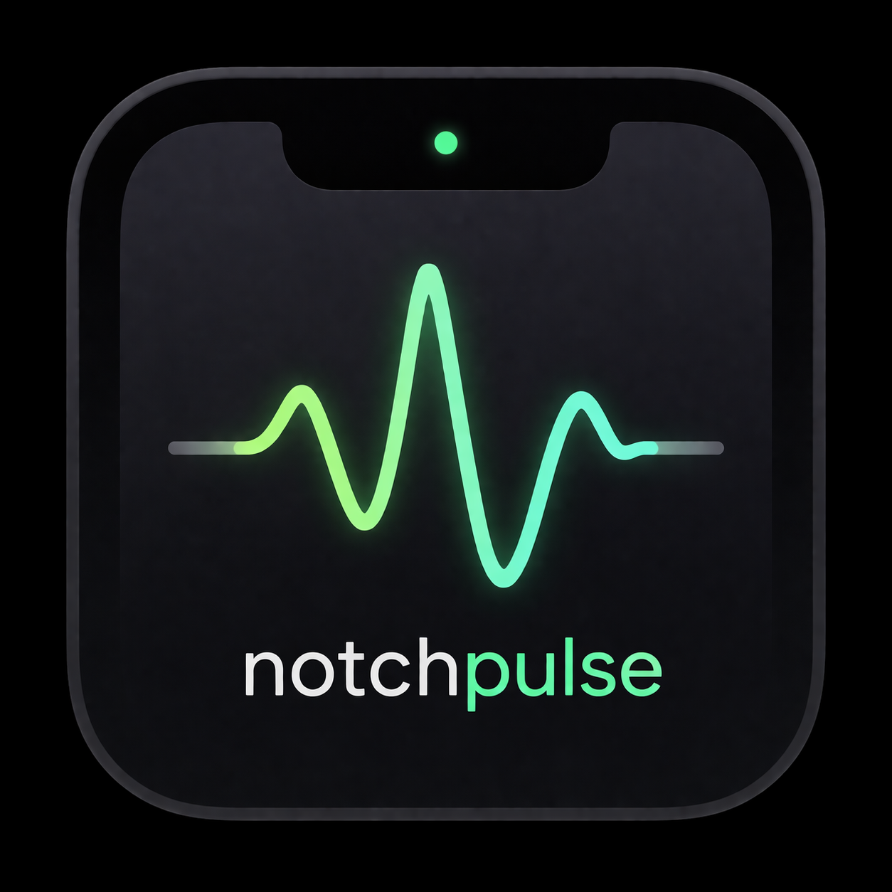
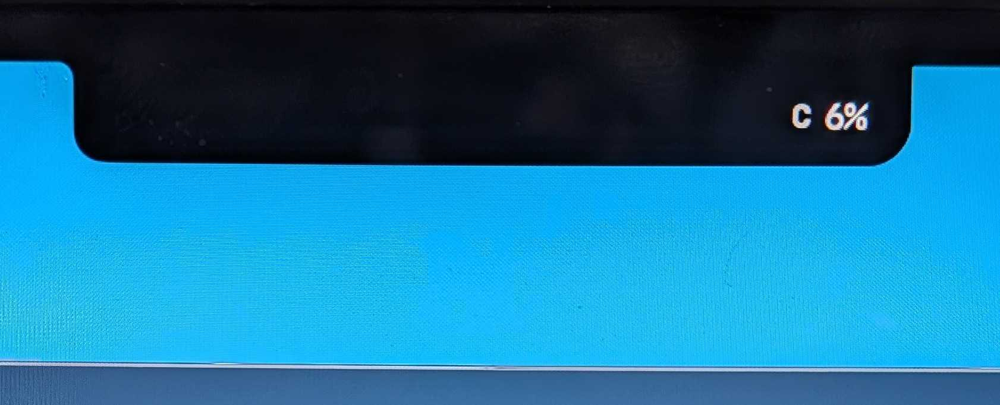

<p align="center">
  
</p>

<h1 align="center">NotchPulse</h1>

<p align="center">A lightweight macOS app that extends your MacBook's notch to display system metrics.</p>

<p align="center">
  
</p>

<p align="center">
  
</p>

The notch becomes a living system monitor — CPU usage, memory pressure, displayed as a natural extension of the notch itself.

## Features

- **Notch-native design** — A black wing extends from the notch, blending seamlessly
- **CPU monitoring** — Total, User, and System CPU usage via Mach kernel APIs
- **Memory monitoring** — Used, App, Wired, and Compressed memory stats
- **Click to configure** — Tap the wing to open a settings panel and switch between CPU/Memory
- **Hover to expand** — Wing widens on hover to show detailed breakdown
- **Load indicators** — Text color shifts: white (normal), orange (warning), red (high load)
- **Minimal footprint** — No Dock icon, no Cmd+Tab entry, < 1% CPU usage

## Requirements

- macOS 13.0 (Ventura) or later
- Apple Silicon Mac (arm64)
- MacBook with notch (works without notch too, but designed for it)

## Install

### Homebrew

```bash
brew install --cask orangekame3/tap/notchpulse
```

### Manual

Download the latest `.tar.gz` from [Releases](https://github.com/orangekame3/notchpulse/releases), extract, and move `NotchPulse.app` to `/Applications`.

### Build from source

```bash
git clone https://github.com/orangekame3/notchpulse.git
cd notchpulse
make install
```

### Note on macOS Gatekeeper

Since the app is not signed with an Apple Developer ID, macOS may show a warning on first launch. To bypass:

```bash
xattr -cr /Applications/NotchPulse.app
```

## Usage

Launch the app — a small black wing appears to the right of your notch, showing `C 12%` (CPU) or `M 28%` (Memory).

| State | Display |
|-------|---------|
| Normal | `C 12%` or `M 28%` |
| Hover | `C 12% U:8 S:3` (detailed breakdown) |
| Click | Settings panel drops down |

### Settings Panel

- **Display** — Switch between CPU and Memory
- **Refresh** — Update interval (1s / 2s / 5s)
- **Start at Login** — Auto-launch toggle
- **Quit** — Exit the app

## Development

```bash
# Debug build + run
make run

# Release build
make release

# Create .app bundle
make app

# Install to /Applications
make install
```

## Architecture

```
Sources/NotchCPUMonitor/
  main.swift               — App entry point, NSApplication setup
  AppDelegate.swift        — Window lifecycle, notch detection
  NotchOverlayWindow.swift — NSPanel (borderless, always-on-top)
  NotchOverlayView.swift   — SwiftUI wing + dropdown trigger
  DropdownPanelView.swift  — Settings panel UI
  CPUStatsProvider.swift   — Mach kernel CPU stats (host_statistics)
  MemoryStatsProvider.swift — VM memory stats (host_statistics64)
  SettingsStore.swift      — UserDefaults persistence
  LoginItemManager.swift   — SMAppService login item
```

## License

[MIT](LICENSE)
